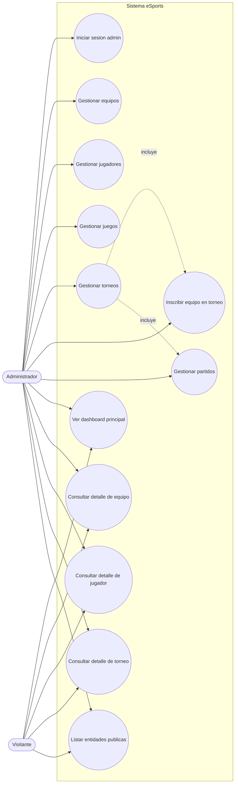
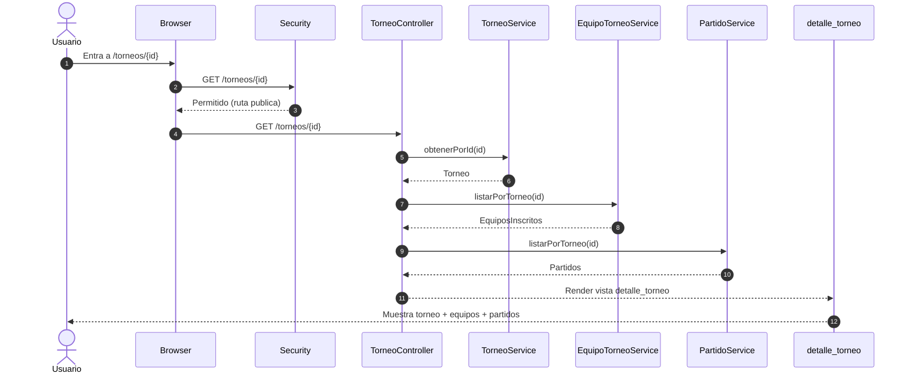
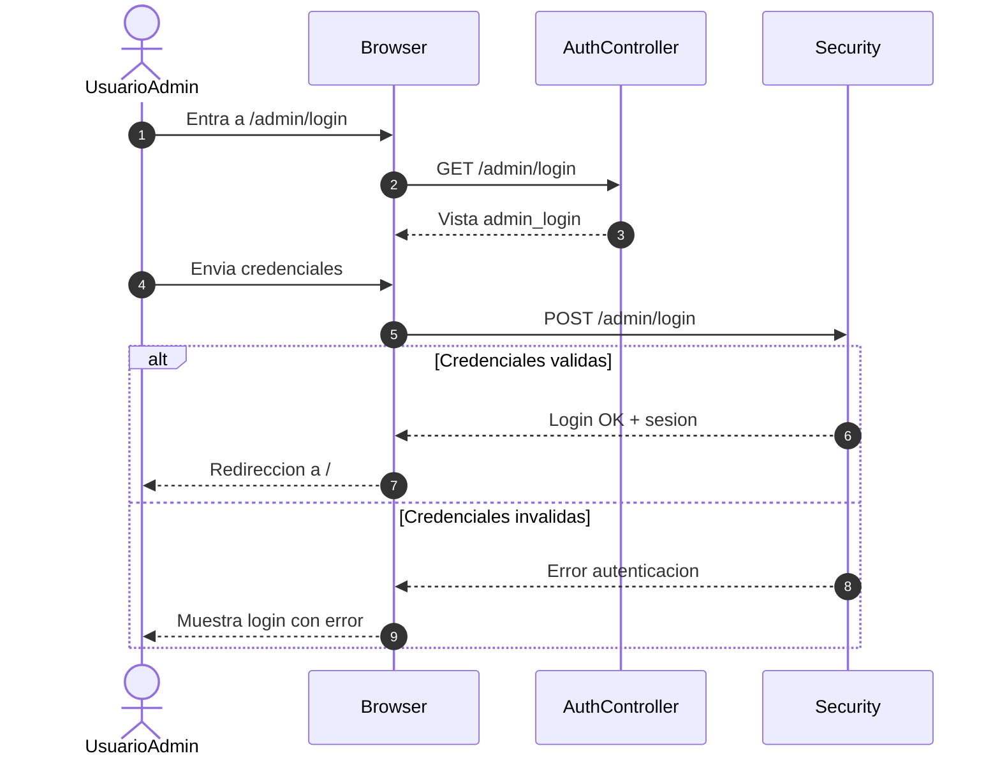
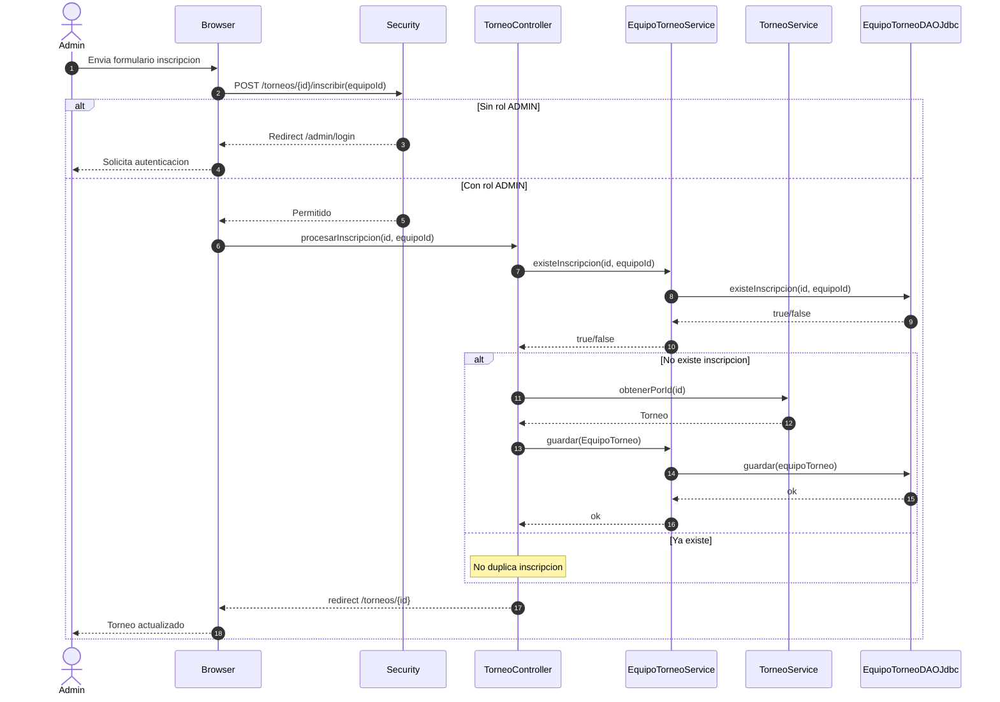
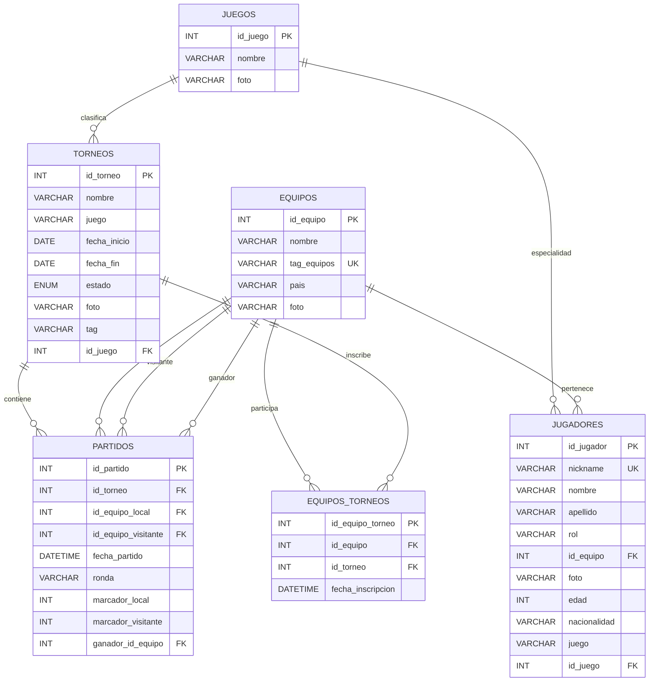

# Diagramas del Sistema eSports

Este archivo incluye cuatro diagramas basados en la estructura real del proyecto.

## 1. Diagrama de clases

```mermaid
classDiagram
    class Equipo {
        +int id
        +String nombre
        +String pais
        +String tag
        +String foto
        +getId() int
        +setId(id int)
        +getNombre() String
        +setNombre(nombre String)
        +getPais() String
        +setPais(pais String)
        +getTag() String
        +setTag(tag String)
        +getFoto() String
        +setFoto(foto String)
    }

    class Jugador {
        +int id
        +String nickname
        +String nombre
        +String apellido
        +String rol
        +String juego
        +String foto
        +int edad
        +String nacionalidad
        +getId() int
        +getNickname() String
        +setNickname(nickname String)
        +getNombre() String
        +setNombre(nombre String)
        +getApellido() String
        +setApellido(apellido String)
        +getRol() String
        +setRol(rol String)
        +getJuego() String
        +setJuego(juego String)
        +getFoto() String
        +setFoto(foto String)
        +getEdad() int
        +setEdad(edad int)
        +getNacionalidad() String
        +setNacionalidad(nacionalidad String)
        +getEquipo() Equipo
        +setEquipo(equipo Equipo)
    }

    class Juego {
        +int id
        +String nombre
        +String foto
        +getId() int
        +setId(id int)
        +getNombre() String
        +setNombre(nombre String)
        +getFoto() String
        +setFoto(foto String)
    }

    class Torneo {
        +int id
        +String nombre
        +String juego
        +LocalDate fechaInicio
        +LocalDate fechaFin
        +String estado
        +String foto
        +String tag
        +getId() int
        +setId(id int)
        +getNombre() String
        +setNombre(nombre String)
        +getJuego() String
        +setJuego(juego String)
        +getFechaInicio() LocalDate
        +setFechaInicio(fechaInicio LocalDate)
        +getFechaFin() LocalDate
        +setFechaFin(fechaFin LocalDate)
        +getEstado() String
        +setEstado(estado String)
        +getFoto() String
        +setFoto(foto String)
        +getTag() String
        +setTag(tag String)
    }

    class Partido {
        +int id
        +LocalDateTime fechaPartido
        +String ronda
        +Integer marcadorLocal
        +Integer marcadorVisitante
        +getId() int
        +setId(id int)
        +getTorneo() Torneo
        +setTorneo(torneo Torneo)
        +getEquipoLocal() Equipo
        +setEquipoLocal(equipoLocal Equipo)
        +getEquipoVisitante() Equipo
        +setEquipoVisitante(equipoVisitante Equipo)
        +getFechaPartido() LocalDateTime
        +setFechaPartido(fechaPartido LocalDateTime)
        +getRonda() String
        +setRonda(ronda String)
        +getMarcadorLocal() Integer
        +setMarcadorLocal(marcadorLocal Integer)
        +getMarcadorVisitante() Integer
        +setMarcadorVisitante(marcadorVisitante Integer)
        +getGanador() Equipo
        +setGanador(ganador Equipo)
    }

    class EquipoTorneo {
        +int id
        +LocalDate fechaInscripcion
        +getId() int
        +setId(id int)
        +getEquipo() Equipo
        +setEquipo(equipo Equipo)
        +getTorneo() Torneo
        +setTorneo(torneo Torneo)
        +getFechaInscripcion() LocalDate
        +setFechaInscripcion(fechaInscripcion LocalDate)
    }

    Equipo "1" --> "0..*" Jugador : tiene
    Juego "1" --> "0..*" Torneo : clasifica
    Juego "1" --> "0..*" Jugador : especialidad
    Equipo "1" --> "0..*" EquipoTorneo : se inscribe en
    Torneo "1" --> "0..*" EquipoTorneo : recibe
    Torneo "1" --> "0..*" Partido : organiza
    Partido "0..*" --> "1" Equipo : equipoLocal
    Partido "0..*" --> "1" Equipo : equipoVisitante
    Partido "0..*" --> "0..1" Equipo : ganador
```

## 2. Diagrama de casos de uso

## 3. Diagramas de secuencia (por partes)

### 3.1 Parte usuario: ver detalle de torneo

### 3.2 Parte usuario admin: iniciar sesion

### 3.3 Parte admin: inscribir equipo en torneo

## 4. Diagrama ER (entidad-relacion)

## Nota

Si tu profesor pide notacion UML estricta para casos de uso (con ovalos UML), puedo pasarte una version en PlantUML de los 4 diagramas tambien.
